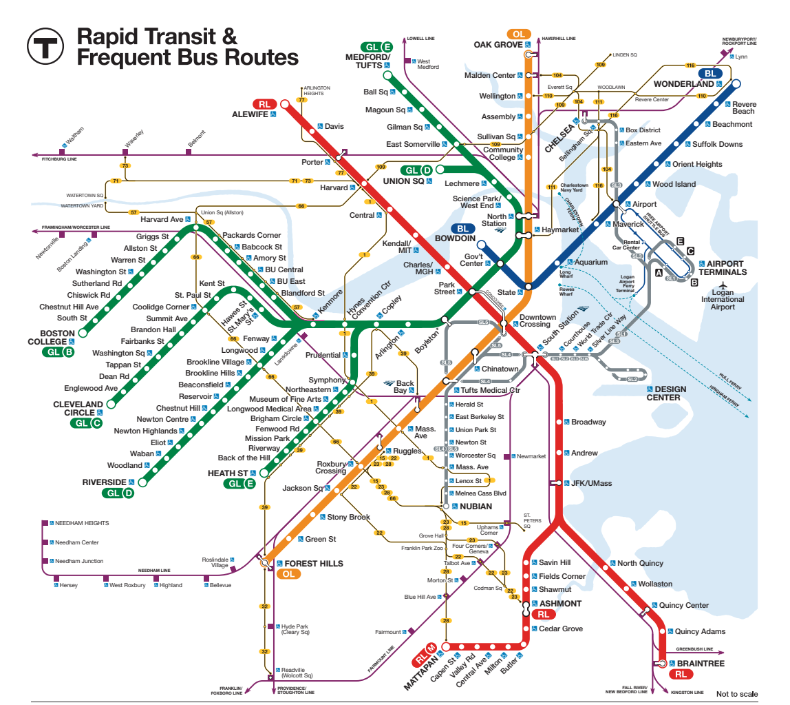

# 🚇 Subway API

A personal project that showcases Spring Boot technologies working together to solve a semi-meaningful problem —
building an API that programmatically reconstructs the [MBTA Subway Map](https://www.mbta.com/subway-map)
using real-world transit data.



---

## 🧠 Project Goals

Create a RESTful API that can:

- Return all subway (light + heavy rail) stops and their metadata
- Report which lines pass through each stop
- Identify neighboring stops by subway line
- Be documented via Swagger/OpenAPI
- Pull real-time data from the [MBTA API v3](https://www.mbta.com/developers/v3-api)

---

## 🗺️ Example Output

```bash
curl --silent 'http://localhost:8080/api/v1/stops?name=downtown' | jq
[
  {
    "id": "place-dwnxg",
    "name": "Downtown Crossing",
    "latitude": 42.355518,
    "longitude": -71.060225
  }
]

curl --silent 'http://localhost:8080/api/v1/connections?stop_id=place-dwnxg' | jq
[
  {
    "line": "Orange",
    "to": { "id": "place-state", "name": "State", ... }
  },
  {
    "line": "Red",
    "to": { "id": "place-sstat", "name": "South Station", ... }
  }
]
```

---

## 🚀 Getting Started
**Requirements**
- Java 17+
- Gradle 8+
- MBTA Developer API Key ([Get one here](https://api-v3.mbta.com/))

1. Create a `.env` file in the root directory:

```
MBTA_API_KEY=your_api_key_here
SPRING_PROFILES_ACTIVE=filedb
```
> ✅ Note: Without `MBTA_API_KEY`, the app will likely fail on startup with `429 TOO_MANY_REQUESTS` due to MBTA API rate
> limiting during DB initialization.

2. Run the application
```shell
./gradlew bootRun
```

The app starts on http://localhost:8080.

---

## 📖 API Docs
Once the app is running, Swagger UI is available at:

🔗 http://localhost:8080/swagger-ui.html

### API endpoints:
| Method | Endpoint                         | Description                                  |
| ------ | -------------------------------- | -------------------------------------------- |
| GET    | `/api/v1/stops`                  | Returns all stops (supports `?name=` filter) |
| GET    | `/api/v1/stops/{id}`             | Returns a specific stop by ID                |
| GET    | `/api/v1/connections?stop_id=ID` | Gets neighbors of a stop via subway lines    |

---

## 🧪 Tests

### Unit Tests (offline)
```./gradlew test```

### Integration Tests (Live MBTA API)
```./gradlew integrationTest```

**Requirements**:
- Internet access
- `.env` with `MBTA_API_KEY`
- Profile set to `filedb` (recommended)

### ⚙️ Spring Profiles
| Profile   | Description                                |
| --------- |--------------------------------------------|
| `default` | In-memory H2 DB (resets each run)          |
| `filedb`  | File-based H2 (stored in `./db/subway-db`) |

---

## 🧩 Data Model Overview

**Entities**:
- `Stop`: station name, ID, GPS
- `Line`: line name (e.g., "Orange", "Green-B")
- `Connection`: directional edge from one stop to another via a line

> 🧠 DB schema is auto-generated using Spring Data JPA

## 📦 Tech Stack
- Java 17
- Spring Boot 3 (Web + Data JPA)
- H2 Database (in-memory + file)
- Swagger/OpenAPI (via springdoc)
- Gradle
- Lombok
- JUnit 5, MockMvc
- [Dotenv plugin for Gradle](https://github.com/uzzu/dotenv-gradle)

## 🔗 Helpful Links
### MBTA
- [MBTA API docs](https://www.mbta.com/developers/v3-api)
- [MBTA API swagger](https://api-v3.mbta.com/docs/swagger/index.html)

### Spring References
* [Spring Web](https://docs.spring.io/spring-boot/3.5.3/reference/web/servlet.html)
* [Spring Data JPA](https://docs.spring.io/spring-boot/3.5.3/reference/data/sql.html#data.sql.jpa-and-spring-data)
* [Testing Spring Boot Applications](https://docs.spring.io/spring-boot/reference/testing/spring-boot-applications.html)

### Helpful Guides
* [Building REST services with Spring](https://spring.io/guides/tutorials/rest/)
* [Accessing Data with JPA](https://spring.io/guides/gs/accessing-data-jpa/)
* [Testing the Web Layer](https://spring.io/guides/gs/testing-web)
  - [JsonPath examples](https://github.com/json-path/JsonPath#path-examples)

## 🧯 Troubleshooting
### ❌ App fails with 429 TOO_MANY_REQUESTS
> 💡 You likely forgot to set the `MBTA_API_KEY`.

✅ Solution: [Request a MBTA API key](https://api-v3.mbta.com/) and add it to a `.env` file in the project root.

## 👤 Author
Tyler Curtis: [LinkedIn](https://www.linkedin.com/in/tjcurtis) • [GitHub](https://github.com/curtis628)

## 📝 License
This project is licensed under the MIT License.